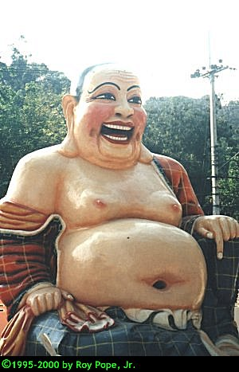



## Cut, Copy, Past & Flip Pictures

### Description

Demonstrates how to select an area within a picture, copy or cut the area to the clipboard, then paste the clipboard contents into the existing picture. Flip the entire picture, or just the selected area.
 
### More Info
 
See code

Learn something new... nothing else

             |
---                |---
**Submitted On**   |2001-03-26 14:17:52
**By**             |[Roy Pope](https://github.com/Planet-Source-Code/PSCIndex/blob/master/ByAuthor/roy-pope.md)
**Level**          |Intermediate
**User Rating**    |4.9 (39 globes from 8 users)
**Compatibility**  |VB 6\.0
**Category**       |[Graphics](https://github.com/Planet-Source-Code/PSCIndex/blob/master/ByCategory/graphics__1-46.md)
**World**          |[Visual Basic](https://github.com/Planet-Source-Code/PSCIndex/blob/master/ByWorld/visual-basic.md)
**Archive File**   |[CODE\_UPLOAD175993262001\.zip](https://github.com/Planet-Source-Code/roy-pope-cut-copy-past-flip-pictures__1-21946/archive/master.zip)

